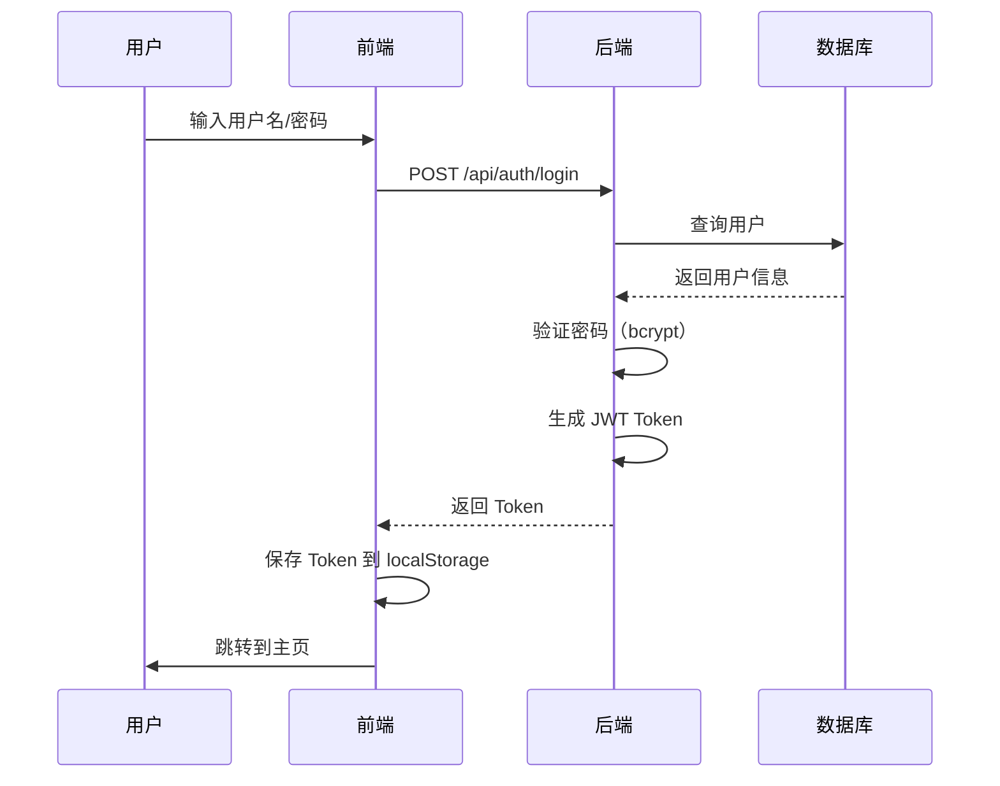

# Claude Code UI - 技术实现架构文档

> 本文档详细介绍了 Claude Code UI 项目的技术实现，包括前端和后端的技术栈、架构设计和核心功能。

## 目录

- [项目概述](#项目概述)
- [前端技术栈](#前端技术栈)
- [后端技术栈](#后端技术栈)
- [项目结构](#项目结构)
- [关键配置文件](#关键配置文件)
- [核心依赖说明](#核心依赖说明)
- [架构设计](#架构设计)
- [数据流程](#数据流程)
- [核心功能](#核心功能)

---

## 项目概述

**Claude Code UI** 是一个基于 Web 的 Claude Code CLI 界面，提供桌面级体验的 AI 交互工具。应用支持多个 AI 提供商（Claude、Cursor、OpenAI Codex），并具有现代化的响应式 UI 和 PWA 能力。

---

## 前端技术栈

### 核心框架与库

| 技术 | 版本 | 用途 |
|------|------|------|
| **React** | 18.2.0 | 主 UI 框架，使用函数组件和 Hooks |
| **React DOM** | 18.2.0 | DOM 渲染 |
| **React Router DOM** | 6.8.1 | 客户端路由 |

### 构建工具

| 技术 | 版本 | 用途 |
|------|------|------|
| **Vite** | 7.0.4 | 构建工具和开发服务器 |
| **@vitejs/plugin-react** | 4.6.0 | Vite 的 React 插件 |
| **PostCSS** | 8.4.32 | CSS 处理 |
| **Autoprefixer** | 10.4.16 | CSS 自动添加前缀 |

### UI 框架与样式

| 技术 | 版本 | 用途 |
|------|------|------|
| **Tailwind CSS** | 3.4.0 | 原子化 CSS 框架 |
| **@tailwindcss/typography** | 0.5.16 | 排版插件 |
| **Lucide React** | 0.515.0 | 图标库 |
| **Class Variance Authority** | 0.7.1 | 组件变体管理 |
| **clsx** | 2.1.1 | 条件 CSS 类名 |
| **tailwind-merge** | 3.3.1 | Tailwind CSS 类合并 |

### 代码编辑器

| 技术 | 版本 | 用途 |
|------|------|------|
| **@uiw/react-codemirror** | 4.23.13 | CodeMirror 的 React 封装 |
| **CodeMirror 语言包** | 多种 | 支持 CSS、HTML、JavaScript、JSON、Markdown、Python |
| **@xterm/xterm** | 5.5.0 | 终端模拟器 |
| **@xterm/addon-clipboard** | - | 剪贴板支持 |
| **@xterm/addon-fit** | - | 自适应大小 |
| **@xterm/addon-web-links** | - | 链接支持 |
| **@xterm/addon-webgl** | - | WebGL 渲染加速 |

### AI 与数据处理

| 技术 | 版本 | 用途 |
|------|------|------|
| **React Markdown** | 10.1.0 | Markdown 渲染 |
| **remark-gfm** | - | GitHub Flavored Markdown 支持 |
| **rehype-katex** | 7.0.1 | KaTeX 数学公式渲染 |
| **gray-matter** | 4.0.3 | Frontmatter 解析 |
| **Fuse.js** | 7.0.0 | 模糊搜索 |

### 状态管理与国际化

| 技术 | 版本 | 用途 |
|------|------|------|
| **React Context API** | - | 全局状态管理 |
| **i18next** | 25.7.4 | 国际化框架 |
| **react-i18next** | 16.5.3 | React 的 i18next 集成 |

### 工具库

| 技术 | 版本 | 用途 |
|------|------|------|
| **react-dropzone** | 14.2.3 | 文件上传处理 |

---

## 后端技术栈

### 运行时与环境

| 技术 | 用途 |
|------|------|
| **Node.js** | JavaScript 运行时 |
| **ES Modules** | 现代 JavaScript 模块系统 |

### Web 框架

| 技术 | 版本 | 用途 |
|------|------|------|
| **Express** | 4.18.2 | Web 服务器框架 |
| **CORS** | 2.8.5 | 跨域资源共享 |
| **WS** | 8.14.2 | WebSocket 实现 |

### 数据库

| 技术 | 版本 | 用途 |
|------|------|------|
| **Better SQLite3** | 12.2.0 | 数据库接口 |
| **SQLite** | 5.1.1 / 5.1.7 | SQLite 数据库引擎 |

自定义数据库模式，用于用户管理和 API 密钥存储。

### AI 提供商集成

| 技术 | 版本 | 用途 |
|------|------|------|
| **@anthropic-ai/claude-agent-sdk** | 0.1.29 | Claude AI 集成 |
| **@openai/codex-sdk** | 0.75.0 | OpenAI Codex 集成 |
| **Cursor CLI** | - | Cursor AI 集成 |

### 认证与安全

| 技术 | 版本 | 用途 |
|------|------|------|
| **JWT** | 9.0.2 | JSON Web Token 令牌 |
| **Bcrypt** | 6.0.0 | 密码哈希加密 |
| **Multer** | 2.0.1 | 文件上传处理 |

### Git 与终端集成

| 技术 | 版本 | 用途 |
|------|------|------|
| **cross-spawn** | 7.0.3 | 进程生成 |
| **chokidar** | 4.0.3 | 文件系统监控 |
| **node-pty** | 1.1.0-beta34 | 伪终端，提供 Shell 访问 |

### 外部服务

| 技术 | 版本 | 用途 |
|------|------|------|
| **Octokit REST** | 22.0.0 | GitHub API 客户端 |
| **node-fetch** | 2.7.0 | HTTP 客户端 |

---

## 项目结构

```
claudecodeui/
├── src/                        # 前端源代码
│   ├── components/             # React 组件
│   │   ├── App.jsx            # 核心应用组件
│   │   ├── auth/              # 认证相关组件
│   │   ├── chat/              # 聊天界面组件
│   │   ├── editor/            # 代码编辑器组件
│   │   └── ...
│   ├── contexts/               # React Context（全局状态）
│   │   ├── AuthContext.jsx    # 认证状态
│   │   ├── ThemeContext.jsx   # 主题状态
│   │   └── ...
│   ├── hooks/                  # 自定义 React Hooks
│   │   ├── useLocalStorage.js # 本地存储 Hook
│   │   ├── useWebSocket.js    # WebSocket Hook
│   │   └── ...
│   ├── i18n/                   # 国际化资源
│   │   ├── zh-CN.json        # 简体中文
│   │   ├── en.json            # 英文
│   │   └── ...
│   ├── lib/                    # 共享库
│   ├── utils/                  # 工具函数
│   ├── App.jsx                 # 主应用组件（路由配置）
│   ├── main.jsx                # 应用入口点
│   └── index.css              # 全局样式
│
├── server/                     # 后端服务器
│   ├── database/               # 数据库操作
│   │   ├── db.js              # 数据库连接和初始化
│   │   ├── schema.sql         # 数据库模式
│   │   └── ...
│   ├── routes/                 # API 路由
│   │   ├── auth.js            # 认证路由
│   │   ├── projects.js        # 项目路由
│   │   ├── sessions.js        # 会话路由
│   │   └── ...
│   ├── middleware/             # Express 中间件
│   │   ├── auth.js           # 认证中间件
│   │   ├── cors.js           # CORS 中间件
│   │   └── ...
│   ├── utils/                  # 服务端工具
│   ├── index.js               # 服务器入口点
│   ├── claude-sdk.js          # Claude AI 集成
│   ├── cursor-cli.js          # Cursor AI 集成
│   ├── openai-codex.js        # OpenAI Codex 集成
│   └── projects.js            # 项目管理逻辑
│
├── shared/                     # 前后端共享模块
│   └── modelConstants.js      # AI 模型定义和常量
│
├── public/                     # 静态资源
│   ├── favicon.ico
│   └── ...
│
├── dist/                       # 构建输出（前端）
│
└── 配置文件
    ├── package.json            # 项目依赖和脚本
    ├── vite.config.js         # Vite 配置
    ├── tailwind.config.js     # Tailwind CSS 配置
    ├── postcss.config.js      # PostCSS 配置
    └── ...
```

---

## 关键配置文件

### package.json

主配置文件，包含：
- 项目依赖（dependencies 和 devDependencies）
- NPM 脚本（启动、构建、开发等）
- CLI 入口点配置
- 支持开发和生产模式

### vite.config.js

Vite 构建配置：
- 开发服务器代理设置（API 代理到后端）
- 代码分块优化
- 环境变量支持
- 插件配置（React 插件）
- 构建输出配置

```javascript
// 主要配置项
export default defineConfig({
  server: {
    port: 5173,
    proxy: {
      '/api': 'http://localhost:3000' // API 代理
    }
  },
  plugins: [react()],
  build: {
    outDir: 'dist',
    rollupOptions: {
      output: {
        manualChunks: {...} // 代码分块
      }
    }
  }
})
```

### tailwind.config.js

Tailwind CSS 配置：
- 深色模式支持（class 策略）
- 自定义颜色方案
- 自定义间距和字体
- 排版插件集成

```javascript
// 主要配置
module.exports = {
  darkMode: 'class', // 深色模式
  theme: {
    extend: {
      colors: {...},    // 自定义颜色
      spacing: {...},   // 自定义间距
      fontFamily: {...} // 自定义字体
    }
  },
  plugins: [
    require('@tailwindcss/typography')
  ]
}
```

### postcss.config.js

PostCSS 配置：
- 自动 CSS 前缀添加（Autoprefixer）
- Tailwind CSS 处理

---

## 核心依赖说明

### React 生态系统

| 依赖 | 用途 |
|------|------|
| **react** | UI 框架核心 |
| **react-dom** | DOM 渲染 |
| **react-router-dom** | 客户端路由，实现页面切换 |

### 构建工具

| 依赖 | 用途 |
|------|------|
| **vite** | 快速构建工具，提供开发服务器和热更新 |
| **@vitejs/plugin-react** | Vite 的 React 支持 |
| **postcss** | CSS 转换 |
| **autoprefixer** | 自动添加浏览器前缀 |

### UI 与样式

| 依赖 | 用途 |
|------|------|
| **tailwindcss** | 原子化 CSS 框架 |
| **lucide-react** | 现代图标库 |
| **cva** | 组件变体管理，实现可复用的组件样式 |

### 代码编辑器

| 依赖 | 用途 |
|------|------|
| **@uiw/react-codemirror** | CodeMirror 编辑器的 React 封装 |
| **@xterm/xterm** | 终端模拟器，支持多语言和主题 |
| **@xterm/addon-*** | Xterm 的各种扩展功能 |

### AI 集成

| 依赖 | 用途 |
|------|------|
| **@anthropic-ai/claude-agent-sdk** | Claude AI 的官方 SDK |
| **@openai/codex-sdk** | OpenAI Codex SDK |
| **cursor-cli** | Cursor AI 的 CLI 工具 |

### 状态管理

| 依赖 | 用途 |
|------|------|
| **React Context** | React 内置的全局状态管理 |
| **自定义 Hooks** | 封装可复用的状态逻辑 |
| **i18next** | 国际化，支持多语言 |

### 后端服务

| 依赖 | 用途 |
|------|------|
| **express** | Web 服务器框架 |
| **sqlite3** | 轻量级数据库 |
| **jwt** | JSON Web Token，用于认证 |
| **node-pty** | 伪终端，提供 Shell 访问能力 |

---

## 架构设计

### 前端架构

#### 组件化设计
- **模块化结构**：组件按功能分类组织
- **可复用性**：通用组件抽取到独立模块
- **单一职责**：每个组件只负责一个功能

#### 状态管理
- **React Context API**：用于全局状态（认证、主题、语言等）
- **自定义 Hooks**：封装业务逻辑，实现代码复用
- **本地状态**：组件级状态使用 useState

#### 响应式设计
- **移动端优先**：从移动端开始设计
- **Tailwind CSS**：使用响应式工具类
- **断点系统**：支持多种屏幕尺寸

#### PWA 能力
- **Service Worker**：离线支持
- **Web App Manifest**：安装到主屏幕
- **响应式设计**：适配各种设备

### 后端架构

#### RESTful API
- **标准接口设计**：遵循 REST 原则
- **模块化路由**：按功能分离路由
- **中间件系统**：认证、日志、错误处理

#### WebSocket 支持
- **实时双向通信**：支持 AI 响应流式传输
- **会话管理**：维护客户端连接状态
- **事件驱动**：基于事件的通信机制

#### 数据持久化
- **SQLite 数据库**：轻量级，无需独立服务器
- **自定义模式**：用户、会话、API 密钥管理
- **事务支持**：保证数据一致性

#### 认证与授权
- **JWT Token**：无状态认证
- **中间件保护**：保护需要认证的路由
- **密码加密**：使用 bcrypt 加密存储

### 通信层

#### WebSocket 连接
- **实时更新**：AI 响应实时推送
- **双向通信**：客户端和服务端可以随时发送消息
- **自动重连**：连接断开时自动重连

#### RESTful API
- **数据操作**：CRUD 操作
- **代理配置**：开发环境下代理 API 请求
- **错误处理**：统一的错误响应格式

#### 多提供商支持
- **Claude SDK**：原生 Claude 集成
- **Cursor CLI**：通过 CLI 集成 Cursor
- **OpenAI Codex**：通过 SDK 集成

---

## 数据流程

### 用户交互流程

```
用户操作 → React 组件事件处理
                ↓
          调用 API / 发送 WebSocket 消息
                ↓
          Express 路由 / WebSocket 处理器
                ↓
          业务逻辑处理
                ↓
    ┌───────────┼───────────┐
    ↓           ↓           ↓
Claude SDK  Cursor CLI  OpenAI SDK
    ↓           ↓           ↓
    └───────────┼───────────┘
                ↓
          返回响应 / WebSocket 消息
                ↓
          React 状态更新
                ↓
          UI 重新渲染
```

### 典型请求流程

#### 1. 用户认证



#### 2. AI 对话交互


#### 3. 项目浏览


### 状态管理流程

#### 前端状态

```javascript
// 全局状态（Context）
┌─────────────────────────────────┐
│         App Context             │
├─────────────────────────────────┤
│ - authStatus: authenticated     │
│ - currentUser: user object      │
│ - theme: dark/light             │
│ - language: zh-CN/en            │
└─────────────────────────────────┘
           ↓
┌─────────────────────────────────┐
│      Component Local State      │
├─────────────────────────────────┤
│ - messages: []                  │
│ - loading: false                │
│ - error: null                   │
└─────────────────────────────────┘
```

#### 后端会话管理

```javascript
// WebSocket 连接管理
┌─────────────────────────────────┐
│     WebSocket Server            │
├─────────────────────────────────┤
│ connections: Map<userId, ws>    │
│ sessions: Map<sessionId, data>  │
└─────────────────────────────────┘
           ↓
┌─────────────────────────────────┐
│      Session Data               │
├─────────────────────────────────┤
│ - sessionId: UUID               │
│ - userId: number                │
│ - messages: []                  │
│ - provider: claude/cursor       │
│ - model: string                 │
└─────────────────────────────────┘
```

---

## 核心功能

### 1. 多 AI 提供商支持

#### Claude AI 集成
- 使用 `@anthropic-ai/claude-agent-sdk`
- 支持所有 Claude 模型（Claude 3 Opus, Sonnet, Haiku）
- 流式响应支持
- 工具调用（Tool Use）支持

#### Cursor AI 集成
- 通过 Cursor CLI 集成
- 支持 Cursor 的所有模型
- 命令行交互封装

#### OpenAI Codex 集成
- 使用 `@openai/codex-sdk`
- 支持 GPT-4 等模型
- 代码生成和补全

**文件位置**：[server/claude-sdk.js](server/claude-sdk.js), [server/cursor-cli.js](server/cursor-cli.js), [server/openai-codex.js](server/openai-codex.js)

### 2. 项目管理

#### 功能特性
- **项目发现**：浏览本地文件系统
- **项目选择**：选择工作目录
- **会话管理**：创建和管理对话会话
- **文件系统集成**：读取和编辑项目文件

#### API 端点
- `GET /api/projects` - 获取项目列表
- `POST /api/projects/browse` - 浏览项目目录
- `POST /api/projects/select` - 选择项目
- `GET /api/projects/:id` - 获取项目详情

**文件位置**：[server/projects.js](server/projects.js)

### 3. 代码编辑器

#### 功能特性
- **语法高亮**：支持多种编程语言
- **代码编辑**：实时编辑文件
- **终端集成**：内置终端模拟器
- **Minimap**：代码缩略图
- **主题切换**：支持深色/浅色主题

#### 技术实现
- CodeMirror 6 作为编辑器核心
- Xterm 作为终端模拟器
- Monaco Editor 风格的 UI

**文件位置**：[src/components/editor/](src/components/editor/)

### 4. 用户体验

#### 主题支持
- **深色模式**：默认主题，保护眼睛
- **浅色模式**：明亮主题
- **跟随系统**：自动适配系统主题

#### 响应式设计
- **移动端优化**：适配手机和平板
- **桌面端优化**：充分利用大屏幕
- **自适应布局**：Flexbox 和 Grid 布局

#### 国际化
- **多语言支持**：中文、英文
- **易于扩展**：基于 i18next，易于添加新语言
- **语言切换**：实时切换无需刷新

#### PWA 功能
- **离线支持**：Service Worker 缓存
- **安装提示**：可安装到主屏幕
- **应用更新**：自动检查和提示更新

**文件位置**：
- 主题：[src/contexts/ThemeContext.jsx](src/contexts/ThemeContext.jsx)
- 国际化：[src/i18n/](src/i18n/)
- PWA：[public/sw.js](public/sw.js)

### 5. 认证系统

#### 功能特性
- **用户注册/登录**：邮箱密码认证
- **JWT Token**：无状态认证
- **会话管理**：Token 刷新机制
- **密码加密**：bcrypt 加密存储

#### 安全机制
- **密码哈希**：使用 bcrypt，不可逆加密
- **Token 有效期**：可配置的过期时间
- **路由保护**：中间件保护需要认证的路由
- **CORS 配置**：跨域请求控制

#### API 端点
- `POST /api/auth/register` - 用户注册
- `POST /api/auth/login` - 用户登录
- `POST /api/auth/logout` - 用户登出
- `GET /api/auth/me` - 获取当前用户信息
- `POST /api/auth/refresh` - 刷新 Token

**文件位置**：
- 路由：[server/routes/auth.js](server/routes/auth.js)
- 中间件：[server/middleware/auth.js](server/middleware/auth.js)
- 数据库：[server/database/db.js](server/database/db.js)

### 6. Git 集成

#### 功能特性
- **仓库检测**：自动识别 Git 仓库
- **状态显示**：显示分支、修改状态
- **命令执行**：执行 Git 命令
- **终端集成**：在终端中执行 Git 操作

#### 技术实现
- `simple-git` 库进行 Git 操作
- `node-pty` 提供终端环境
- 实时输出流式返回

### 7. 实时通信

#### WebSocket 通信
- **双向通信**：客户端和服务端随时发送消息
- **流式响应**：AI 响应流式传输到客户端
- **自动重连**：连接断开时自动尝试重连
- **心跳检测**：定期发送心跳包保持连接

#### 事件类型
- `message` - 聊天消息
- `response` - AI 响应
- `error` - 错误消息
- `status` - 状态更新
- `heartbeat` - 心跳包

**文件位置**：[server/index.js](server/index.js) (WebSocket 服务器)

---

## 技术亮点

### 1. 现代化技术栈
- **React 18**：最新的 React 特性
- **Vite**：极快的开发体验
- **Tailwind CSS**：快速 UI 开发

### 2. 类型安全（可选）
- 支持 TypeScript（虽然当前项目使用 JavaScript）
- 可以逐步迁移到 TypeScript

### 3. 模块化设计
- 前后端分离
- 功能模块独立
- 易于维护和扩展

### 4. 性能优化
- **代码分割**：按需加载
- **懒加载**：路由级别代码分割
- **缓存策略**：Service Worker 缓存静态资源
- **虚拟滚动**：长列表性能优化

### 5. 开发体验
- **热更新**：Vite HMR
- **ESLint**：代码检查
- **调试友好**：Source Map 支持

---

## 扩展性

### 添加新的 AI 提供商

1. 在 [server/](server/) 目录下创建新的集成文件
2. 实现统一的接口（发送消息、流式响应）
3. 在 [shared/modelConstants.js](shared/modelConstants.js) 中添加模型定义
4. 在前端添加相应的 UI 配置

### 添加新的语言

1. 在 [src/i18n/](src/i18n/) 目录下创建新的语言文件
2. 在 i18next 配置中注册新语言
3. 前端添加语言切换选项

### 添加新的功能模块

1. 后端：在 [server/routes/](server/routes/) 创建新路由
2. 前端：在 [src/components/](src/components/) 创建新组件
3. 在 [src/App.jsx](src/App.jsx) 中添加路由

---

## 部署

### 开发环境

```bash
# 安装依赖
npm install

# 启动开发服务器
npm run dev

# 前端：http://localhost:5173
# 后端：http://localhost:3000
```

### 生产环境

```bash
# 构建前端
npm run build

# 启动生产服务器
npm start

# 或者使用 PM2
pm2 start server/index.js --name claude-code-ui
```

### Docker 部署

```dockerfile
# 示例 Dockerfile
FROM node:18-alpine

WORKDIR /app

# 安装依赖
COPY package*.json ./
RUN npm install --production

# 复制代码
COPY . .

# 构建前端
RUN npm run build

# 暴露端口
EXPOSE 3000

# 启动服务
CMD ["npm", "start"]
```

---

## 总结

Claude Code UI 是一个架构清晰、技术先进的全栈应用：

- **前端**：React + Vite + Tailwind CSS，提供现代化用户体验
- **后端**：Node.js + Express + SQLite，轻量高效
- **AI 集成**：支持多个 AI 提供商，扩展性强
- **实时通信**：WebSocket 支持，流畅的交互体验
- **工程化**：模块化设计，易于维护和扩展

该项目展示了现代 Web 开发的最佳实践，是一个优秀的全栈应用示例。
